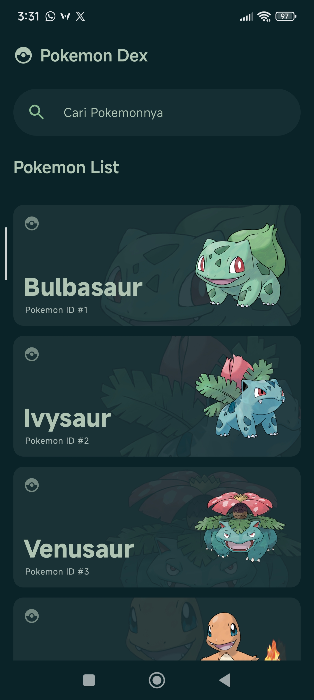
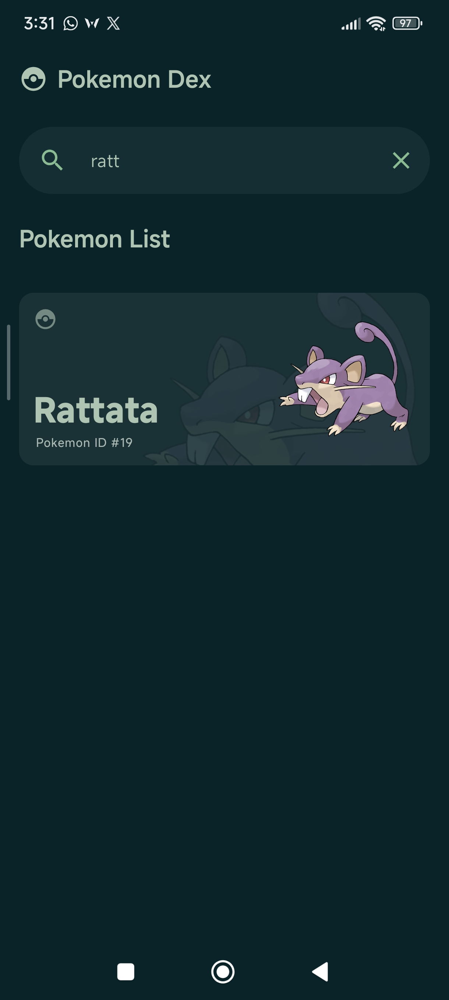
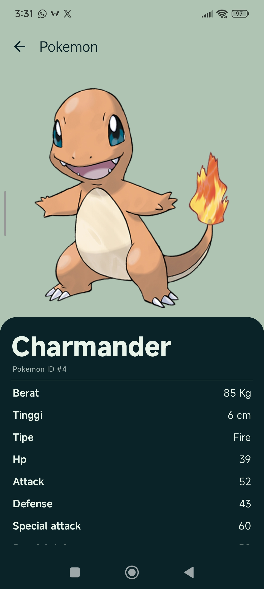
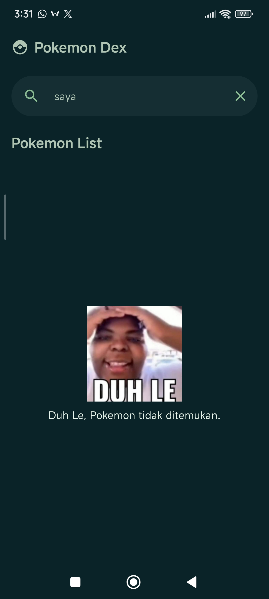
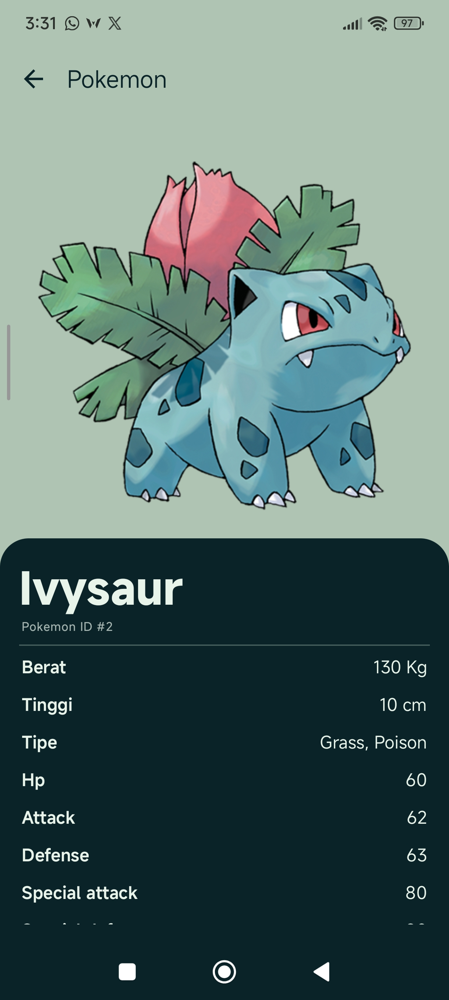
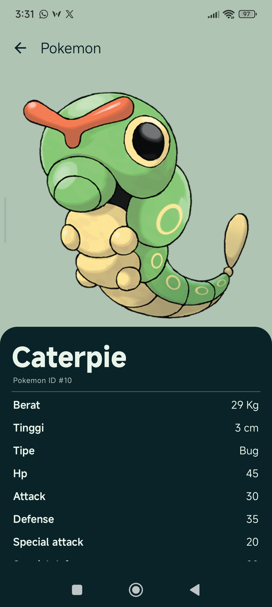

# Pokemon Dex
> Aplikasi katalog dan eksplorasi Pokémon berbasis PokéAPI

---

## 👤 Identitas Praktikan
- **Nama Lengkap:** Arzaq Vincent Putra Prasetyo
- **NIM:** H1D024051
- **Shift Awal:** Shift C
- **Shift Akhir:** Shift C
- **Link Video Demo/Penjelasan:** [YouTube](https://youtu.be/-ofMezIQfoU)

---

## Deskripsi Aplikasi
Pokémon memiliki banyak karakter dengan tipe, kemampuan, dan statistik yang berbeda. Aplikasi ini membantu pengguna mencari, melihat, dan mengeksplorasi informasi Pokémon langsung dari perangkat mobile. Data diambil secara dinamis dari [PokéAPI](https://pokeapi.co/docs/v2) (REST API publik, tanpa API key), lalu ditampilkan dalam daftar yang bisa dicari berdasarkan nama. Pengguna dapat membuka halaman detail untuk melihat gambar, ID, tipe, tinggi, berat, dan statistik dasar Pokémon.

Target pengguna: penggemar Pokémon yang ingin referensi cepat tentang karakter favoritnya.

---

## Penjelasan Teknis

### 1. Spesifikasi & Tech Stack
- **Bahasa:** Kotlin 2.2.10
- **UI Framework:** Jetpack Compose (Material 3, dark theme dengan palette kustom)
- **Min SDK:** 24 (Android 7.0) | **Target SDK:** 37
- **Pola Arsitektur:** MVVM (Model-View-ViewModel)
- **Library Utama:**
  - `Navigation Compose` (perpindahan Home ke Detail)
  - `ViewModel` & `StateFlow` (state management, `collectAsStateWithLifecycle`)
  - `Retrofit` + `Gson` (networking dan parsing JSON)
  - `OkHttp Logging Interceptor` (debug request)
  - `Coil 3` (image loading)
  - `Kotlin Coroutines` (async, fetch paralel)

### 2. API yang Digunakan
Base URL: `https://pokeapi.co/api/v2/`

| Endpoint | Kegunaan |
|---|---|
| `GET pokemon?limit={n}` | Daftar Pokémon (`name` dan `url`) |
| `GET pokemon/{id}` | Detail Pokémon |

Field yang dipakai dari respons detail: `id`, `name`, `height`, `weight`, `types`, `stats`, `abilities`, `base_experience`, dan `sprites.other.official-artwork.front_default` (gambar).

Catatan: `height` dalam desimeter dan `weight` dalam hektogram, sehingga dikonversi ke meter dan kilogram saat ditampilkan.

### 3. Fitur Utama
- **Home Screen:** Menampilkan judul, search bar, dan daftar Pokémon (gambar, nama, ID) menggunakan lazy layout. Data diambil lewat `HomeViewModel` yang memanggil `PokemonRepository`.
- **Search:** Filter nama dilakukan di ViewModel terhadap daftar yang sudah dimuat (tanpa request tambahan). Query disimpan di `StateFlow` sehingga UI recompose otomatis. Tersedia tampilan kosong jika tidak ada hasil.
- **Loading & Error State:** UI berubah mengikuti `UiState` (`Loading`, `Success`, `Error`). Pada state error tersedia tombol Retry.
- **Detail Screen:** Menampilkan gambar, nama, ID, tipe, tinggi, berat, dan statistik. Data diambil dari cache di repository sehingga tidak memanggil API ulang.
- **Fetch Paralel & Cache:** Detail tiap Pokémon diambil paralel (`async`, dibatasi `Semaphore`) saat loading awal, lalu disimpan di cache memori. Kegagalan satu item tidak menggagalkan seluruh daftar.

### 4. Penerapan Konsep Kotlin & Compose
- **Data class:** model respons API (`PokemonDetail`, `PokemonResultResponse`, dll.).
- **Null safety:** field opsional dari API bertipe nullable, diakses dengan `?.` dan `?:` (contoh: gambar dengan fallback).
- **Lambda:** event handler (`onTextQueryChange`, `onClick`) dan operasi koleksi (`map`, `filter`).
- **State & recomposition:** UI dibangun dari `StateFlow`; perubahan state memicu recomposition hanya pada bagian yang berubah.
- **Reusable composable:** `MyOwnSearchBar`, kartu Pokémon, tampilan loading/error, bar statistik.

### 5. Struktur Direktori Proyek
```text
app/src/main/java/io/duhle/pokemon/
├── data/
│   ├── model/        # Data class (respons list & detail)
│   ├── network/      # PokemonApiInterface (Retrofit), ApiClient
│   └── repository/   # PokemonRepository (fetch + cache)
├── ui/
│   ├── components/   # Composable reusable
│   ├── screens/      # Home & Detail (Screen + ViewModel + UiState)
│   └── theme/        # Color, Type, Theme Material 3
├── utility/          # Konstanta (PokemonConstant)
└── MainActivity.kt
```

Alur data: `Composable → ViewModel → Repository → API Service → PokéAPI`, lalu hasil kembali ke UI melalui `StateFlow`.

---

## Tangkapan Layar (Screenshots)

| Home | Search | Detail |
|:---:|:---:|:---:|
|  |  |  |
| |  |  |
| | |  |

---

## VideoDemo

<video src="./docs/video-demo.mp4" width="100%" controls></video>

---

## Cara Menjalankan Proyek

1. **Prasyarat:**
   - Android Studio versi terbaru.
   - JDK 17 atau lebih baru.
   - Emulator atau perangkat fisik Android (API 24 ke atas) dengan koneksi internet.

2. **Langkah:**
   ```bash
   # Clone repository
   git clone https://github.com/Zaqpurpur-Neo/H1D024051_Responsi-1-Praktikum-Pemorgramman-Mobile
   ```
3. Buka folder proyek di **Android Studio**.
4. Tunggu proses **Gradle Sync** selesai.
5. Pilih emulator/perangkat, lalu klik **Run (`Shift + F10`)**.

---

## Catatan
- Search hanya mencari di daftar Pokémon yang sudah dimuat (default 20 item), bukan seluruh database PokéAPI.
- Model `PokemonDetail` awalnya dihasilkan dengan converter JSON-to-Kotlin, lalu dipangkas ke field yang dibutuhkan.
